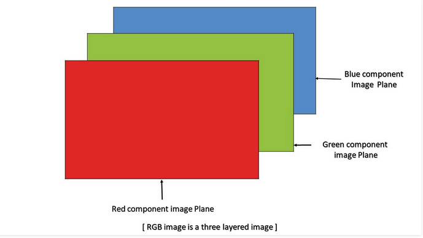

# 🏁 Image Segmentation System

Image  segmentation  is  a  fundamental  process  in  many  image,  video,  and  computer  vision applications. It is often used to partition an image into separate regions. Threshold  technique  is  one  of  the  important  techniques  in  image  segmentation. We can divide the pixels in the image into two major groups, according to their gray-level. In this project, threshold operation is implemented in Verilog. 
## Threshold Operation
   The simplest approach to segment an image is using thresholding. The simplest thresholding methods replace each pixel in an image with a black pixel if the image intensity I (i,j)  is less than some fixed constant T, or a white pixel if the image intensity is greater than that constant.
  
## Implementation
First argument is the source image, which should be a grayscale image. Second argument is the threshold value which is used to classify the pixel values. If pixel value is greater than a threshold value, it is assigned one value (white), else it is assigned another value (black).

📌 Note: Verilog cannot read bitmap format file. So we will convert the image in 
bitmap format into hexadecimal file.
* 📍 read_data:
	In this module, there will be two parts. The first part is reading and the other
part is processing. 
 We use 3 intermediate signals RGB to save image data
and a  Finite state machine for reading RGB888 data from memory and creating horizontal synchronization and vertical synchronization pulses.
* 📍 write_data: In this module we will write the image (the processed image) into
a bitmap image.

📌 Note: If you you change the image size, you'll have to change the bmp header. [More info](http://www.fastgraph.com/help/bmp_header_format.html).

### Grayscale
Grayscaling is the process of converting an image from other color spaces to shades of gray. It varies between complete black and complete white. An RGB image can be viewed as three images( a red scale image, a green scale image and a blue scale image). Each pixel has three different
components which are red, green and blue. Average method is the most simple one to convert an color image into a grayscale image. You just have to take the average of three colors. Since its an RGB image, so it means that you have add r with g with b and then divide it by 3 to get your desired grayscale image.

## Dependencies

This project needs [Xlinx ISE](https://en.wikipedia.org/wiki/Xilinx_ISE).

### Building on Windows 10

 1. Download Xilinx ISE from [here](https://www.xilinx.com/support/download/index.html/content/xilinx/en/downloadNav/vivado-design-tools/archive-ise.html).

  2. Clone the repository. 
  3. Simulate the design in hdl folder. (You you need to run 6ms in simulation).
  4. Now you see that the output image will be available.

### TODO
 - ⭕ Add threshold filter
 
